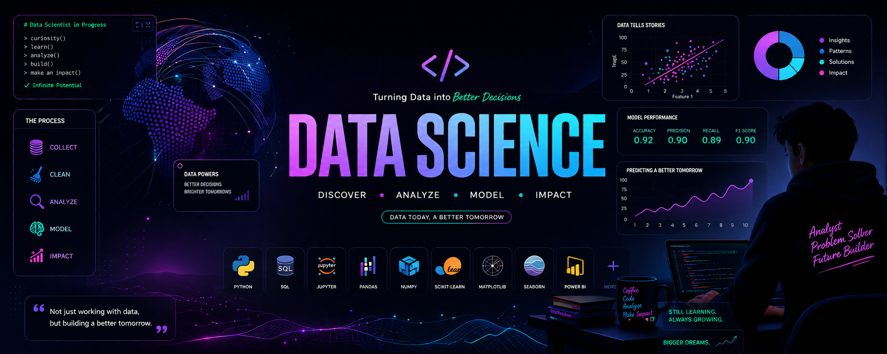
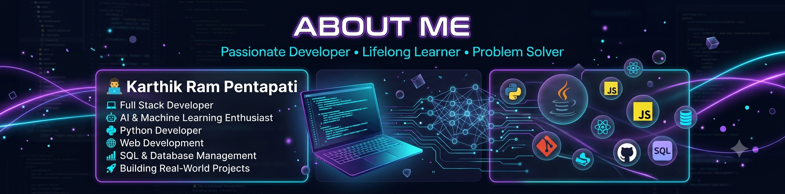

  

<h1 align="center">Hi 👋 I'm Karthik Ram Pentapati</h1>

<h3 align="center">
💻 Passionate Developer • 🚀 Tech Enthusiast
</h3>

# 👨‍💻 About Me

- 🎓 Data Science Student
- 💻 Passionate Full Stack Developer
- 🐍 Python Developer
- 🌐 HTML • CSS • JavaScript
- ⚛️ Learning React & Node.js
- 🚀 Building Real World Projects
- 🌱 Always Learning New Technologies

# 🚀 Tech Stack

# 🚀 Featured Projects

| Project | Tech |
|---------|------|
| 🤖 AI Resume Portfolio Generator | Python • Flask |
| 🌐 Full Stack Website | React • Node.js |
| 📊 Data Dashboard | Python • SQL |
# 📊 GitHub Stats

# 🔥 GitHub Streak

# 📈 GitHub Activity Graph

# 📈 GitHub Activity Graph

# 🏆 GitHub Trophies

# 🧠 Skills Progress

Python          █████████░░
Java            ████████░░░
JavaScript      ████████░░░
React           ██████░░░░░
Node.js         ██████░░░░░
SQL             ███████░░░░
# 💼 Current Focus

- 🚀 Full Stack Development
- 💻 DSA Practice
- 🐍 Python Projects
- ⚛️ React Development
- 🌐 Web Development
- # 🎯 2026 Goals

- ✅ Master Full Stack Development
- ✅ Build 20+ Projects
- ✅ Solve 300+ DSA Problems
- ✅ Crack Top Product Company
- # 💬 Random Dev Quote

# 🌐 Connect With Me

# 🐍 Contribution Snake

<h2>💜 Thanks for Visiting My Profile 💜</h2>

⭐ If you like my work, consider giving a ⭐ to my repositories.

